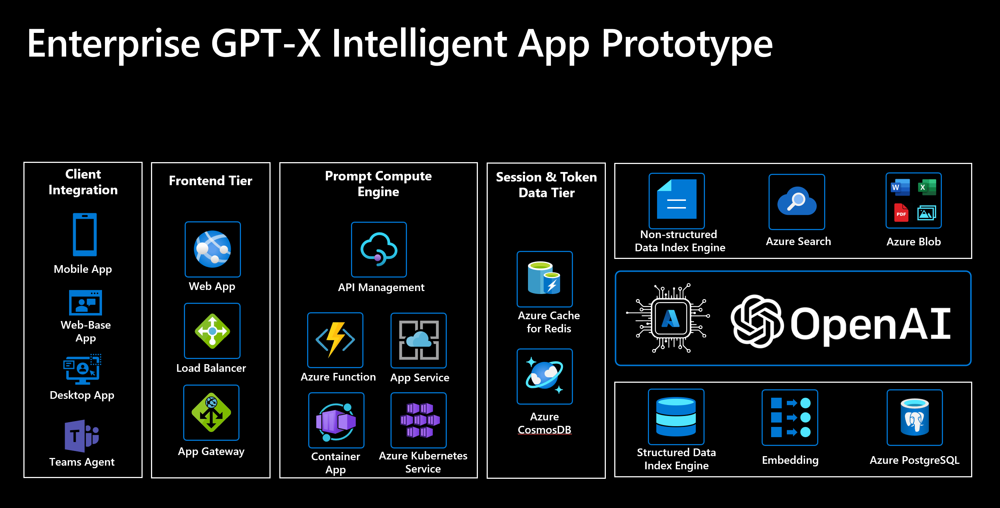
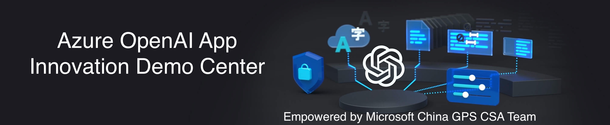

# App innovation with Azure Openai In-A-Day --Microsoft China GPS Tech 

 
## In-A-Day介绍 
App innovation with Azure Openai In-a-day Workshop利用一天时间与客户一起交流Azure Openai技术及解决方案，并演示基于场景的openai demo，并根据客户需求定制化一些内容，比如可能增加动手实验环节。所需基本客户交流的deck在[这里](./Workshop%20Content/)

### 以下是在In-A-Day Workshop上重点完成的动手实验：
- [快速入门：体验ChatGPT并通过程序调用它的API](https://learn.microsoft.com/zh-cn/azure/cognitive-services/openai/chatgpt-quickstart?tabs=command-line&pivots=programming-language-studio)
- [企业特定领域的知识问答：OCR + QA](https://github.com/teo-ma/azure-open-ai-embeddings-qna)
- [关系型数据SQL智能交互](https://github.com/teo-ma/AzureSQLChatGPTDemo)

### 以下是供参考的sample，动手实验指南或文档：

- [部署企业自己的Chat GPT-openai官方Chatgpt的最小克隆](https://github.com/tgpteo-ma/cosmosdb-chat)
- [使用 OpenAI API 构建智能聊天机器人并将并部署到 Azure App Service 和Microsoft Teams App](https://github.com/microsoft/gps-csa-tech-stack/tree/main/Create-A-ChatGPT-Bot-APP-and-Deploy-To-Azure-APP-Service-or-Teams-APP)
- [探索 Azure OpenAI 服务嵌入和文档搜索](https://learn.microsoft.com/zh-cn/azure/cognitive-services/openai/tutorials/embeddings?tabs=command-line)
- [使用语音与 Azure OpenAI 对话](https://github.com/openai/openai-cookbook)
- [包含多个不同场景的sample请参考Openai官方Cookbook](https://github.com/openai/openai-cookbook)
- [Azure Openai官方文档](https://learn.microsoft.com/zh-cn/azure/cognitive-services/openai/)

## 在线体验不同场景的Azure Openai Demo（微软中国GPS CSA团队提供）请访问[Openai Democenter](https://agreeable-flower-0968eb610.2.azurestaticapps.net/)

 

## Contributing

This project welcomes contributions and suggestions.  Most contributions require you to agree to a
Contributor License Agreement (CLA) declaring that you have the right to, and actually do, grant us
the rights to use your contribution. For details, visit https://cla.opensource.microsoft.com.

When you submit a pull request, a CLA bot will automatically determine whether you need to provide
a CLA and decorate the PR appropriately (e.g., status check, comment). Simply follow the instructions
provided by the bot. You will only need to do this once across all repos using our CLA.

This project has adopted the [Microsoft Open Source Code of Conduct](https://opensource.microsoft.com/codeofconduct/).
For more information see the [Code of Conduct FAQ](https://opensource.microsoft.com/codeofconduct/faq/) or
contact [opencode@microsoft.com](mailto:opencode@microsoft.com) with any additional questions or comments.

## Trademarks

This project may contain trademarks or logos for projects, products, or services. Authorized use of Microsoft 
trademarks or logos is subject to and must follow 
[Microsoft's Trademark & Brand Guidelines](https://www.microsoft.com/en-us/legal/intellectualproperty/trademarks/usage/general).
Use of Microsoft trademarks or logos in modified versions of this project must not cause confusion or imply Microsoft sponsorship.
Any use of third-party trademarks or logos are subject to those third-party's policies.
